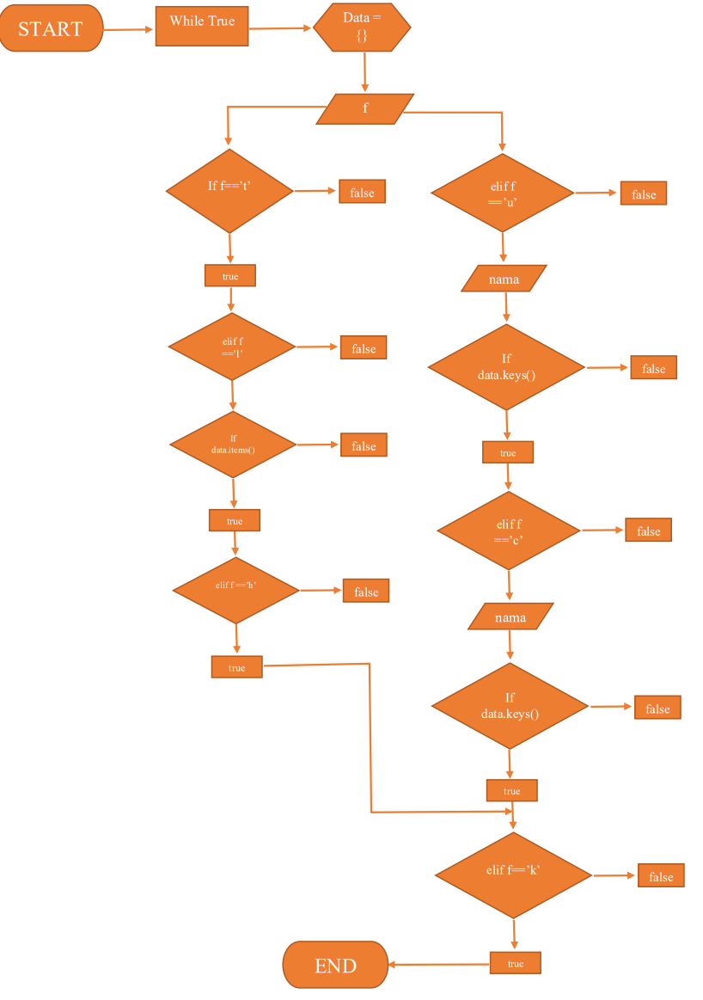
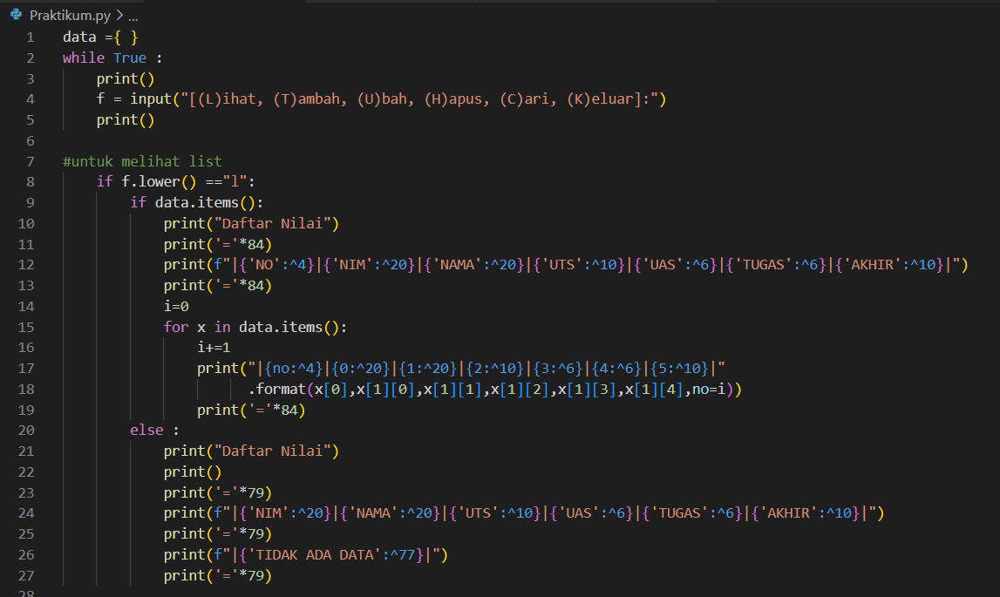
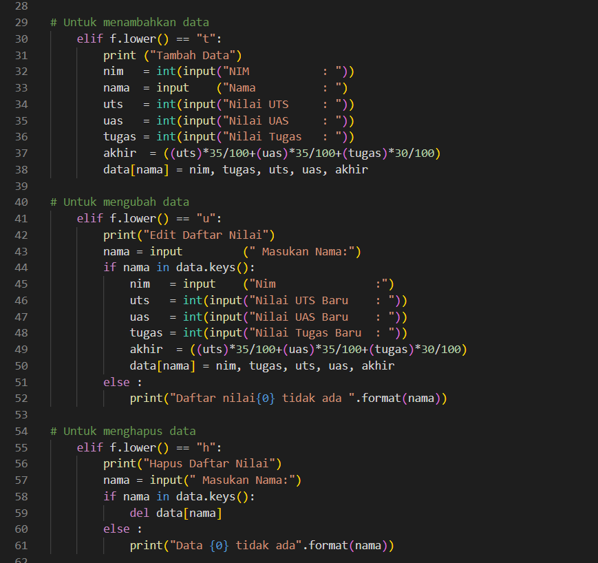
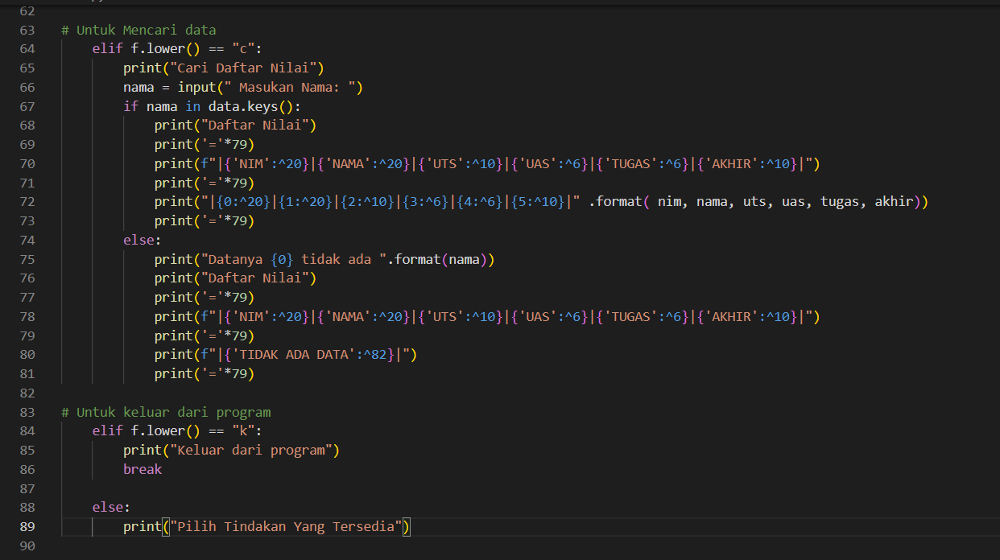
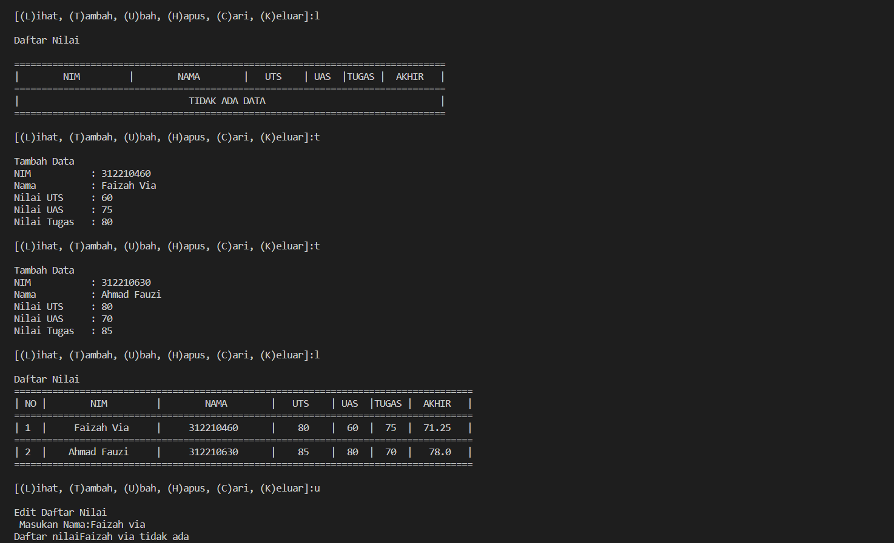
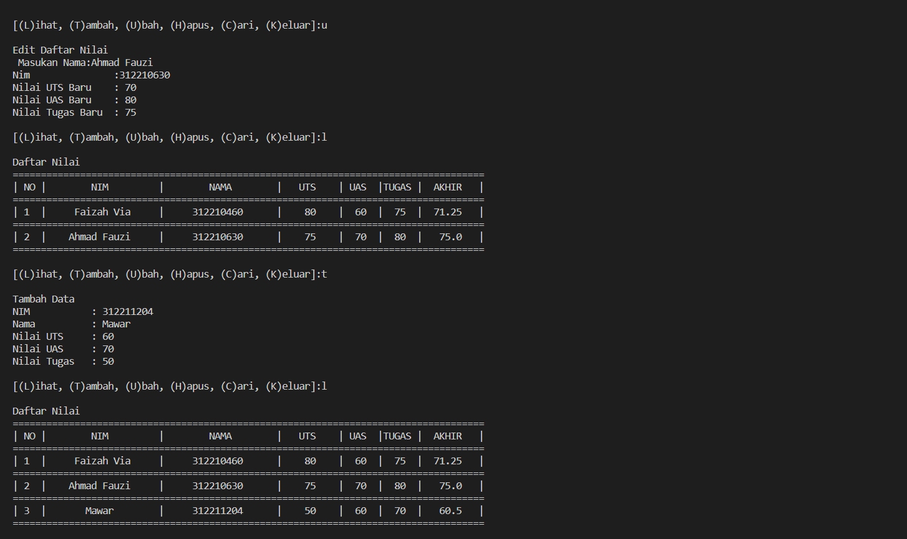
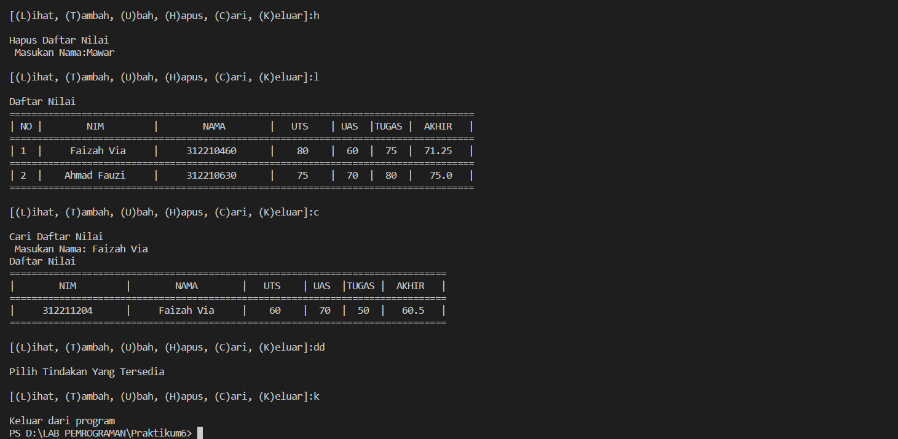

# Pratikum6

# program sederhana yang akan menampilkan Daftar Nilai

# FLOWCHART

# PROGRAMNYA

# PENJELASAN PROGRAM

Mulai
1. Pertama anda menginputkan data={}, lalu diisi sesuai dengan keinginan anda, dengan menggunakan format dictionary.
2. Gunakan perulangan While True untuk menampilkan data sebanyak mungkin. 
3. Masukan Perintah f = input("(L)ihat, (T)ambah, (U)bah, (H)apus, (C)ari, (K)eluar:"), untuk mendapatkan perintah Lihat, Tambah, Ubah, Hapus, Cari, keluar.
4. Jika ingin memilih "Lihat" gunakan fungsi 'elif' dan gunakan fungsi 'for X in data.items():' untuk memasukan data kedalam tabel data yang kita inputkan. dengan perintah "l".
5.  Untuk "Tambah" data gunakan fungsi elif, lalu masukan nim, nama, uts, uas, tugas, akhir. akhir didapat dari = ((uts)*35/100+(uas)*35/100+(tugas)*30/100) 
6. Untuk menampilkan pilihan "Hapus" maka gunakan fungsi 'elif' lalu gunakan fungsi 'if nama in data.keys():' kemudian fungsi 'del.data[nama] jika nama yang kita hapus tidak ada dalam tabel maka gunakan fungsi 'else' untuk menampilkan Daftar Nilai tidak ada.
7. Untuk menampilkan pilihan "Cari" gunakan fungsi 'elif' kemudian gunakan fungsi 'if nama in data.keys():' untuk mencari data nama kemudian gunakan fungsi 'else' untuk menampilkan data nama yang kita cari = tidak ada.
8. Jika ingin "Keluar" dari program gunakan fungsi 'if' kemudian gunakan fungsi break untuk keluar dari data nilai/program sudah selesai.

# HASIL PROGRAMNYA

